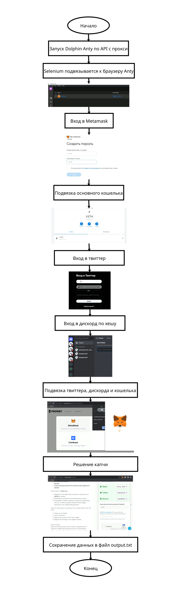

<h3>Описание</h3>

Скрипт на python для участия в розыгрыше NFT на сайте premint. Использует dolphin anty через api и прокси. Selenium подвязывается к dolpin anty. 
  Создает кошелек в metamask, подвязывает сторонний кошелек к созданному. Авторизуется в твиттер, дискорд по хешу. На сайте premint подвязывает твиттер, дискорд и метамаск. Решает капчу и сохраняет данные в output.txt

Должны быть заполнены файлы:

<ul>
  <li>Dolphin_Enty_auth</li>
  <li>proxy</li>
  <li>дискорды</li>
  <li>Приват ключи</li>
  <li>твиттеры</li>
</ul>

Также необходимо заполнить ключ и ключ вэбсайта premint для решения антикапчи

В dolphin anty должен быть установлено разширение metamask

При старте укажите количество итераций

<h3>Алгоритм работы</h3>

